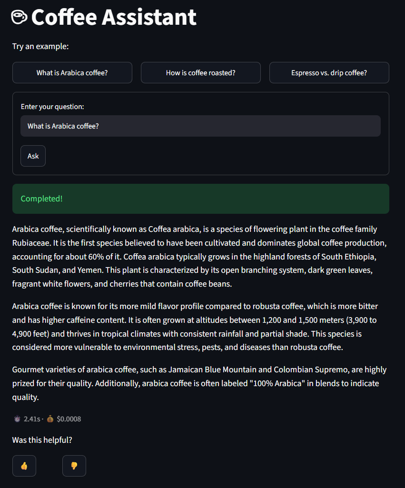
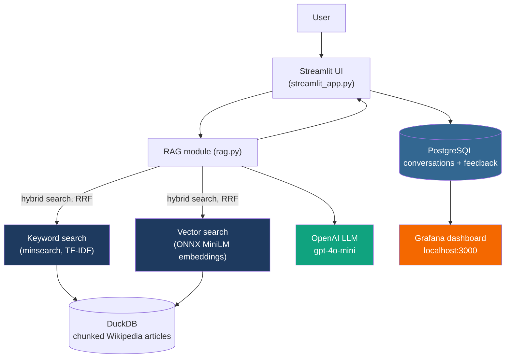
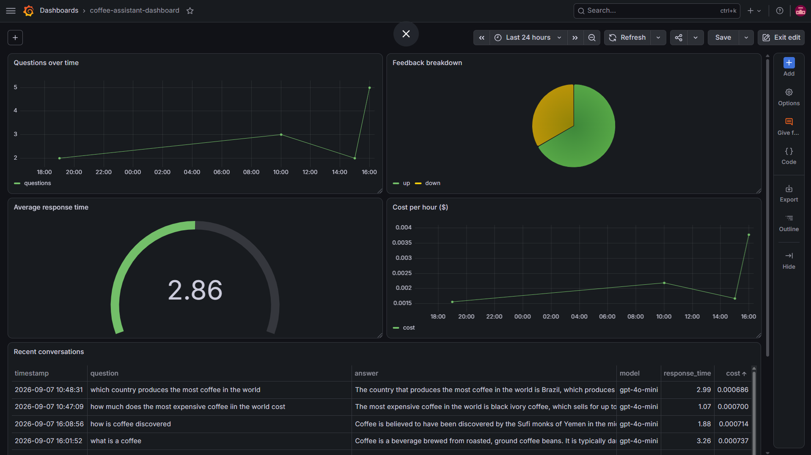

# Coffee Assistant

A coffee recommendation/Q&A RAG assistant built for the LLM Zoomcamp capstone project.

**Live demo:** [coffee-assist.streamlit.app](https://coffee-assist.streamlit.app/)

## Problem

Learning about coffee — origins, roasting, brewing methods, regional differences — usually
means digging through long, disconnected Wikipedia articles to find one specific answer.
Coffee Assistant is a RAG chatbot that lets you just ask ("What's the difference between
Arabica and Robusta?", "How is coffee roasted?") and get a direct, sourced answer pulled from
that same set of articles, instead of reading through them yourself.



## Quickstart

```bash
cp .env.example .env    # add your OPENAI_API_KEY
docker compose up -d --build
uv run python -c "from coffee_assistant.db import init_db; init_db()"   # once, to create the Postgres tables
```

The app runs at http://localhost:8501, Grafana at http://localhost:3000. The image
bakes in the prebuilt DuckDB index and ONNX embedder model, so it needs no outbound
network calls to start.

## Data

Coffee-related Wikipedia articles (Coffee, Espresso, Coffee roasting, Arabica coffee,
coffee-producing regions, etc.), ingested and chunked via a [dlt](https://dlthub.com/)
pipeline into a local DuckDB database.

The original plan was to use [Coffee Review](https://www.coffeereview.com/) tasting
reviews as the primary source, pending permission from the site (email sent to the
lead reviewer). Permission hadn't come through by the project deadline, so Wikipedia —
always the fallback path — is what's in production. Nothing about the pipeline is
Wikipedia-specific; adding Coffee Review later is a second `dlt` source feeding the
same DuckDB table, not a rebuild.

## Full setup

```bash
uv sync
```

Copy `.env.example` to `.env` and add your `OPENAI_API_KEY`. The `POSTGRES_*`/`GRAFANA_*`
vars are only needed for monitoring — defaults work fine for local use.

### Running locally

```bash
uv run streamlit run streamlit_app.py
```

Opens a browser UI with a question box. On startup it builds the knowledge base
(fetching/chunking the Wikipedia articles into DuckDB if it doesn't exist yet, then
the keyword index and vector embeddings), shown with a loading spinner; every
question after that hits the cached index directly. If you're not running Postgres/Grafana
in Docker too, start just those two: `docker compose up -d postgres grafana`.

### From Python

```python
from coffee_assistant.rag import rag

rag("What regions produce Arabica coffee?")
```

## Ground truth

`notebooks/ground-truth-generation.ipynb` generates 5 synthetic user questions per chunk with
`gpt-4o-mini`, keyed by `chunk_id`, saved to `data/ground-truth-retrieval.csv`
(504 chunks, 2520 questions) — used for the retrieval/LLM evaluation steps.

## Retrieval evaluation

`notebooks/retrieval-eval.ipynb` evaluates three retrieval strategies against the
ground-truth question set, using Hit Rate and MRR (top 10 results):

| Method | Hit Rate | MRR |
|---|---|---|
| Keyword (TF-IDF) | 0.556 | 0.338 |
| Vector (ONNX MiniLM embeddings) | 0.633 | 0.404 |
| Hybrid (RRF, k=60 default) | 0.751 | 0.391 |
| **Hybrid (RRF, k=1)** | **0.751** | **0.421** |

Hybrid search — merging keyword and vector rankings via Reciprocal Rank Fusion (RRF) —
wins on Hit Rate outright, and with a tuned `k=1` it also beats vector search on MRR
(the RRF literature default of `k=60` is tuned for rankings in the thousands; it
barely differentiates a top-10 candidate list — see the notebook for the full
explanation). **Hybrid search with `k=1` is used in production**, in
`coffee_assistant/retrieval.py`'s `hybrid_search()`, called from `rag.py`'s `search()`.

Vector embeddings come from a local ONNX MiniLM model (`coffee_assistant/embedder.py`,
adapted from the LLM Zoomcamp `02-vector-search` module) — no API calls, no PyTorch
dependency, and a small enough footprint to keep the eventual Docker image lightweight.

**Best practices:** hybrid search (combining keyword and vector search, evaluated above)
is used in production.

## LLM evaluation

`notebooks/llm-eval.ipynb` compares two RAG prompts on 100 sampled ground-truth
questions, judged by gpt-4o-mini as an LLM judge (NON_RELEVANT / PARTLY_RELEVANT / RELEVANT):

| Prompt | Relevant | Partly relevant | Non relevant |
|---|---|---|---|
| **Default** | **0.97** | 0.02 | 0.01 |
| "I don't know" variant | 0.91 | 0.03 | 0.06 |

The default prompt (used in production, `rag.py`'s `prompt_template`) wins outright,
so no change was needed — this evaluation confirms it over an alternative that
explicitly allows the model to say "I don't know" when context is insufficient.

## Architecture



## Monitoring

Every question asked in the Streamlit app is logged to Postgres — question, answer, model,
prompt, token counts, response time, and estimated cost — and each answer has 👍/👎 feedback
buttons that log to a separate `feedback` table (`coffee_assistant/db.py`). See
[Quickstart](#quickstart) to bring up Postgres + Grafana alongside the app.

Grafana (`localhost:3000`, default login `admin`/`admin`) has a 5-panel dashboard built on
top of those two tables:



- **Questions over time** — question volume, bucketed hourly.
- **Feedback breakdown** — thumbs up vs. down.
- **Average response time** — RAG pipeline latency.
- **Cost per hour ($)** — estimated OpenAI spend, bucketed hourly.
- **Recent conversations** — a live table of the latest Q&A pairs with cost/latency.

The dashboard isn't provisioned automatically — `grafana/dashboard.json` is the exported
dashboard definition; import it via Grafana's UI (Dashboards → New → Import) to reproduce it.

## Decisions and trade-offs

- **Wikipedia over Coffee Review**: the primary source was pending third-party
  permission that didn't arrive in time (see [Data](#data)). Wikipedia was the
  planned fallback from the start, so the pipeline and eval work didn't need to
  change when the deadline hit.
- **Hybrid search + gpt-4o-mini**: hybrid search (RRF) beat keyword-only and
  vector-only on Hit Rate and MRR (see [Retrieval evaluation](#retrieval-evaluation)),
  and gpt-4o-mini scored 0.97 RELEVANT against an alternative prompt's 0.91
  (see [LLM evaluation](#llm-evaluation)) — good enough that a larger, pricier
  model wasn't worth it.

## Project structure

- `coffee_assistant/ingest.py` — fetches Wikipedia articles, chunks them, loads them
  into DuckDB via a dlt pipeline, and builds the keyword search index.
- `coffee_assistant/embedder.py` — local ONNX MiniLM embedder used for vector search
  (no API calls); auto-downloads the model into `models/` (gitignored) on first use via
  `download_embedder.py` if it isn't already there.
- `coffee_assistant/retrieval.py` — keyword, vector, and hybrid (RRF) search; this is
  the production search used by `rag.py`.
- `coffee_assistant/rag.py` — prompt building and the LLM call; `search()` delegates
  to `retrieval.hybrid_search()`; tracks response time and estimated cost.
- `coffee_assistant/db.py` — Postgres logging: `init_db()` creates the `conversations`/
  `feedback` tables, `save_conversation()`/`save_feedback()` write to them.
- `streamlit_app.py` — Streamlit UI: a question box that calls `rag()`, displays the
  answer with token usage, logs the conversation, and shows +1/-1 feedback buttons.
- `Dockerfile` / `docker-compose.yml` — containerizes the app (Streamlit), Postgres, and
  Grafana into one stack (see [Quickstart](#quickstart) above).
- `grafana/dashboard.json` — exported Grafana dashboard definition (see
  [Monitoring](#monitoring) above).
- `notebooks/ground-truth-generation.ipynb` — generates the ground-truth question set
  used for retrieval/LLM evaluation.
- `notebooks/retrieval-eval.ipynb` — evaluates keyword vs. vector vs. hybrid search
  (results in [Retrieval evaluation](#retrieval-evaluation) above).
- `notebooks/llm-eval.ipynb` — compares RAG prompts with an LLM judge
  (results in [LLM evaluation](#llm-evaluation) above).
- `data/` — source titles list, ground-truth CSV, and per-prompt LLM-eval results
  (`rag-eval-default.csv`, `rag-eval-v2.csv`); the generated DuckDB file is gitignored
  and rebuilt on first run.
- `requirements.txt` — pip-format dependency list generated from `pyproject.toml`/`uv.lock`
  via `uv export --no-dev --no-hashes --no-emit-project --format requirements-txt -o requirements.txt`,
  for hosts (e.g. Streamlit Community Cloud) that don't install from `uv.lock` directly.
  Regenerate it after changing dependencies.
